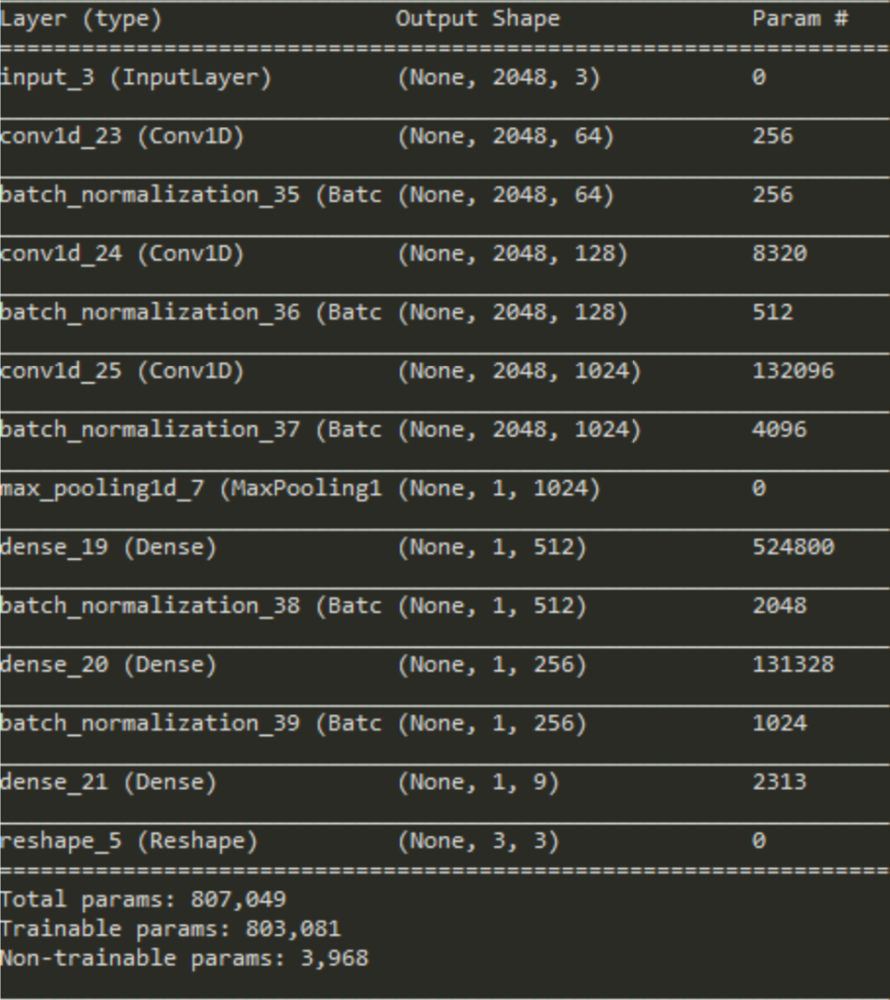
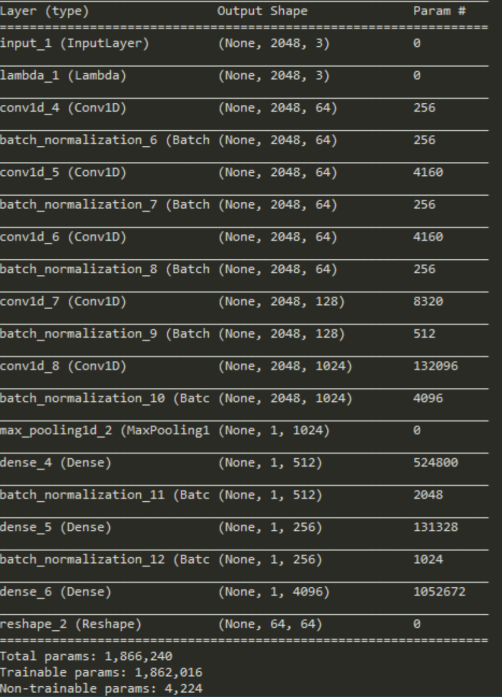
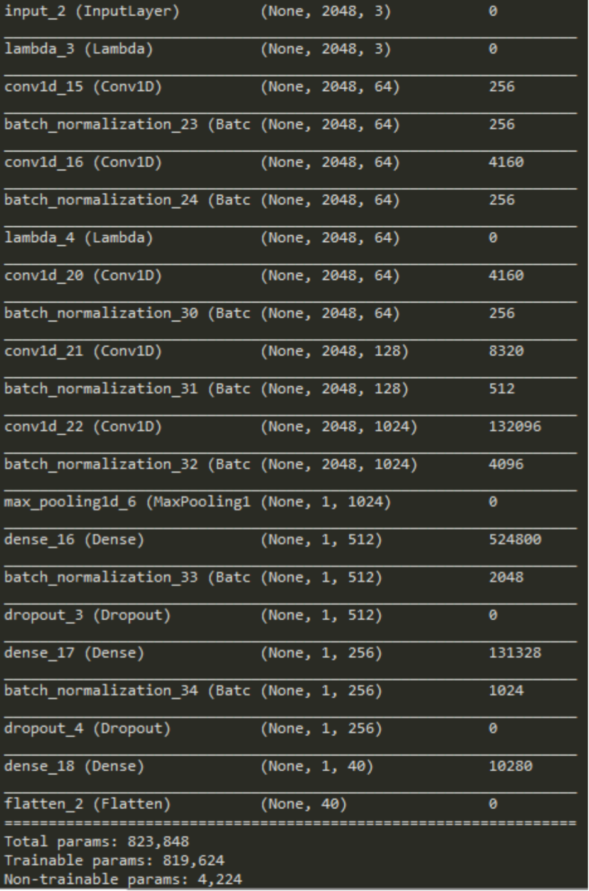
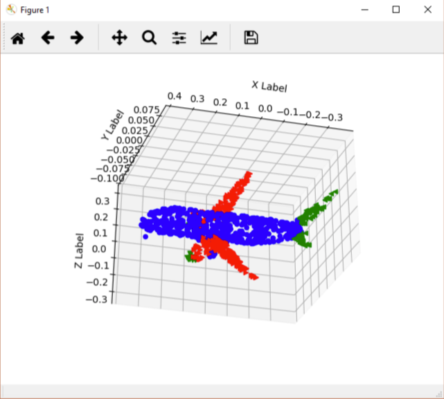

# pointnet-keras
Original tensorflow implementation: https://github.com/charlesq34/pointnet

Package requirement: Python3.6, keras, tensorflow, numpy, matplotlib, h5py

## Point Architecture

- Input Transformation Net: Input: Nx3 point cloud sample, Output: 3x3 transformation net

- Feature Transformation Net:

- Global Feature: Input: Nx3 point cloud sample multiply input T_net. Output: 1*1024 global feature

- Classification Net: Input: Nx3 point cloud sample multiply input T_net. Output: 1x40 softmax prediction

## Results

- Classification Sample

## How to Run code:

### Classification:
- Download the aligned dataset from [Link](https://shapenet.cs.stanford.edu/media/modelnet40_ply_hdf5_2048.zip)
- Put all traning `.h5` files under `Prepdata` folder, all testing `.h5` files under `Prepdata_test` folder
- Run train_cls.py. Accuracy rate will be 82.5%, which is slightly lower than the original implementation. 

### Segmentation:
- Download and unzip the shapenet dataset from [Link](https://shapenet.cs.stanford.edu/ericyi/shapenetcore_partanno_v0.zip).
- Run Seg_dataprep.py then train_seg.py.

